# LAB-20-STATIC-ROUTING-
Jum'at 15 Agustus 2025

# Static Routing
  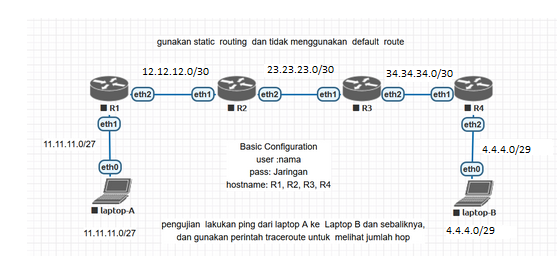  
  
# Router 1
  1. Buat username dan password sesuai perintah di Topologi.  

         user add name=ahnaf password=jaringan group=full  
  2. Login mengunakan user yang telah dibuat.  
  3. Ganti Identitas RB menjadi **R1**.  

          system identity set name=R1
  4. Tambahkan IP Address untuk ether1 dan ether2. Di **IP > Addresses**
     ether1 = 11.11.11.1/27 (untuk koneksi ke laptop A)  
     ether2 = 12.12.12.1/30 (untuk koneksi ke R2)  
  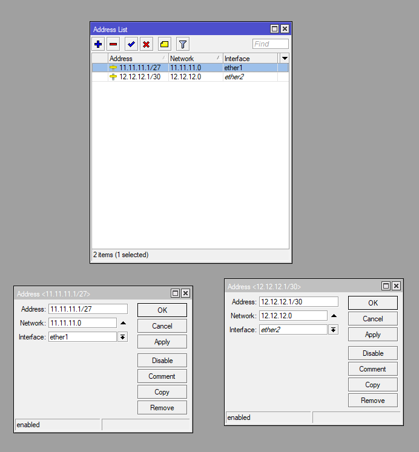  
  5. Sekarang konfigurasi static routing di **IP > Route > Routes**  
  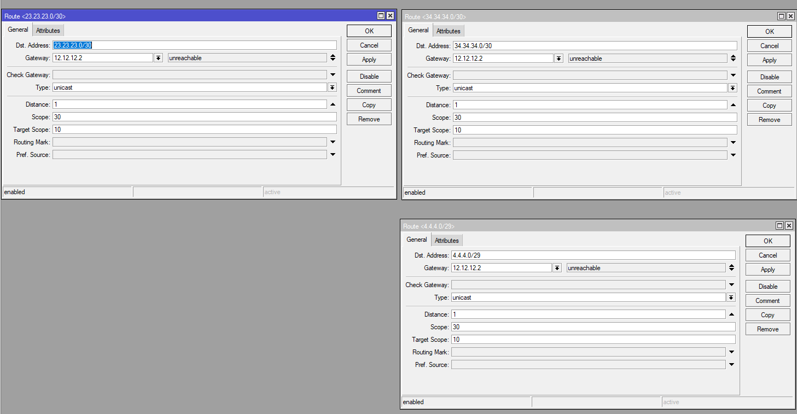  
  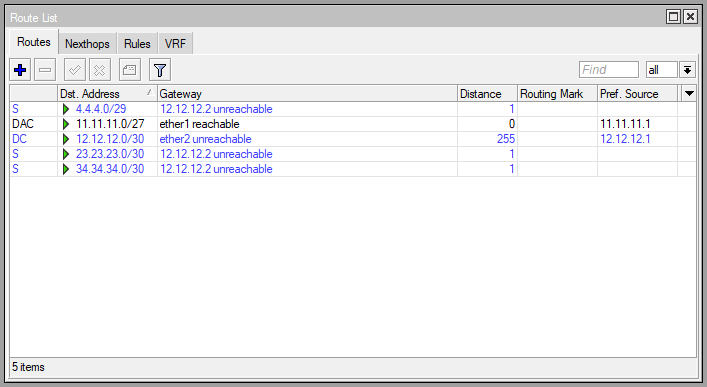  
  
# Router 2  
  1. Buat username dan password sesuai perintah di Topologi. Di **System > user**.  
     USN : ahnaf  
     PASS: Jaringan   
  2. Login mengunakan user yang telah dibuat.  
  3. Ganti Identitas RB menjadi **R2**.  **system > identity**.  
  4. Tambahkan IP Address untuk ether1 dan ether2. Di **IP > Addresses**  
     ether1 = 12.12.12.2/30 (untuk koneksi  R1)  
     ether2 = 23.23.23.1/30 (untuk koneksi  R3)  
  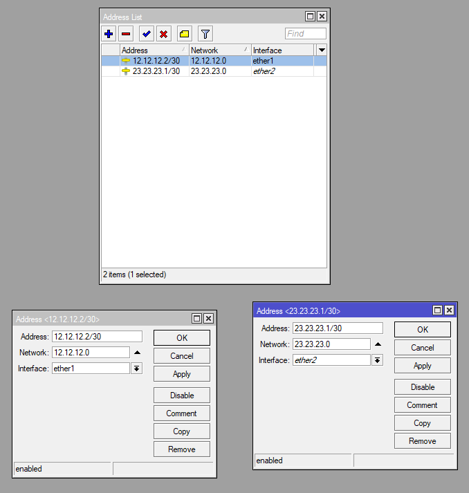  
  
  5. Sekarang konfigurasi static routing di **IP > Route > Routes**  
  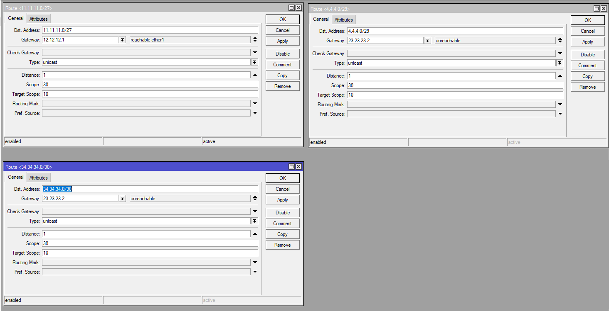  
    

# Router 3
  1. Buat username dan password sesuai perintah di Topologi. Di **System > user**.  
     USN : ahnaf  
     PASS: Jaringan   
  2. Login mengunakan user yang telah dibuat.  
  3. Ganti Identitas RB menjadi **R3**.  **system > identity**.  
  4. Tambahkan IP Address untuk ether1 dan ether2. Di **IP > Addresses**  
     ether1 = 23.23.23.2/30 (untuk koneksi ke R2)  
     ether2 = 34.34.34.1/30 (untuk koneksi ke R4)  
  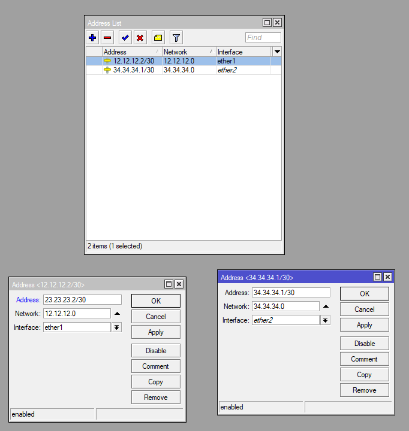  
  
  5. Sekarang konfigurasi static routing di **IP > Route > Routes**  
  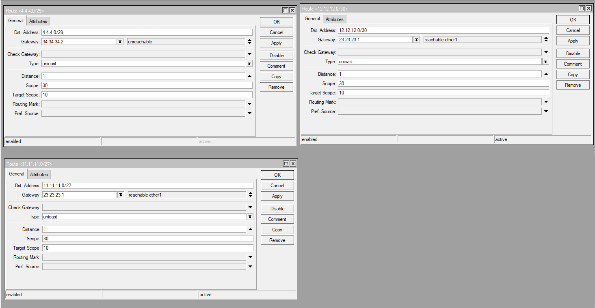  
    

# Router 4  
  1. Buat username dan password sesuai perintah di Topologi. Di **System > user**.  
     USN : ahnaf  
     PASS: Jaringan   
  2. Login mengunakan user yang telah dibuat.  
  3. Ganti Identitas RB menjadi **R4**.  **system > identity**.  
  4. Tambahkan IP Address untuk ether1 dan ether2. Di **IP > Addresses**  
     ether1 = 34.34.34.2/30 (untuk koneksi ke R3)  
     ether2 = 4.4.4.1/29 (untuk koneksi ke Laptop B)  
  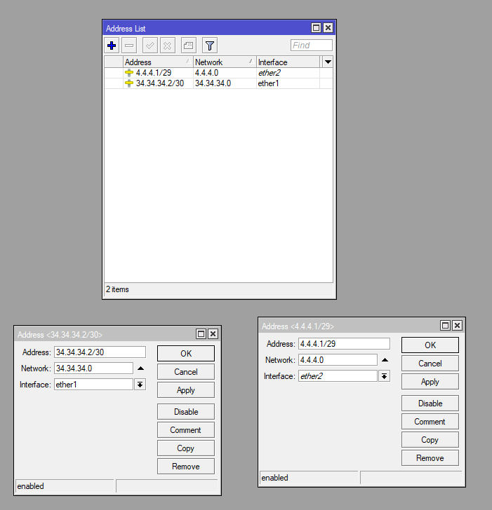  
  
  5. Sekarang konfigurasi static routing di **IP > Route > Routes**  
  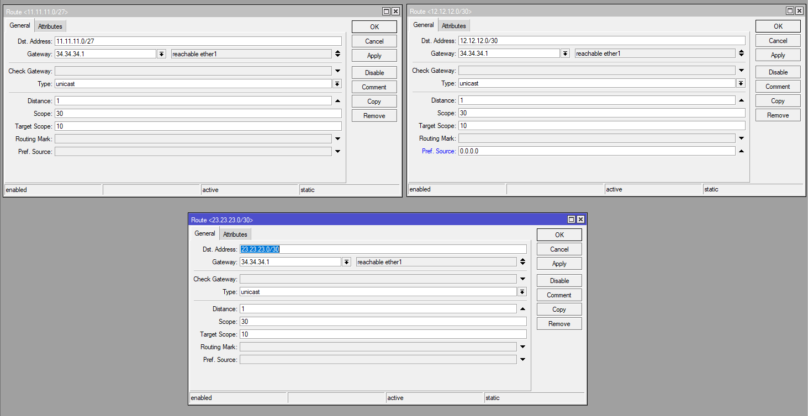  
    
  
# Laptop  
  Jika semua router sudah di konfigurasi, selanjutnya kita setting IP untuk setiap laptop. Melalui Control Panel.  
  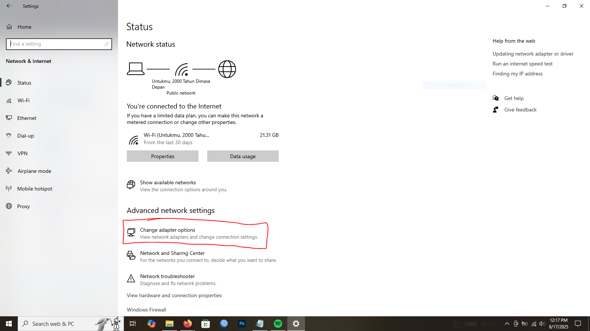  
  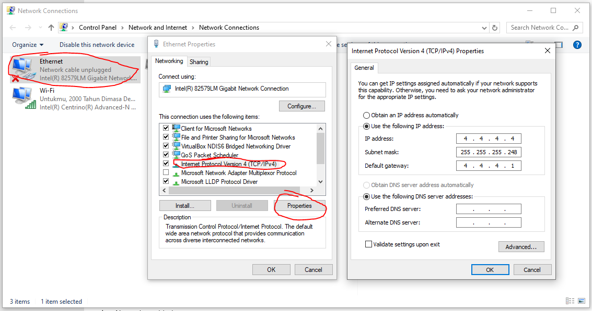  
    
  Laptop A = 11.11.11.2   
  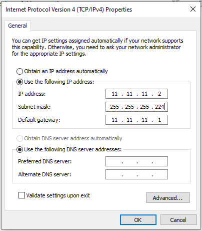  
  Laptop B = 4.4.4.4  
  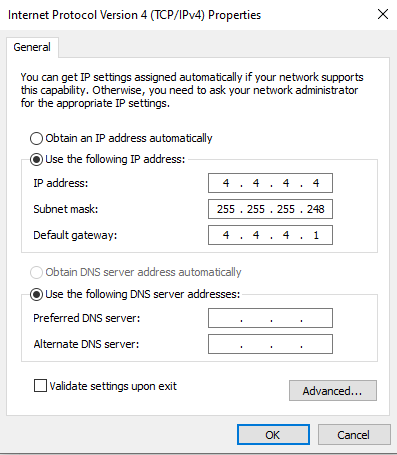  
  Jika sudah coba ping dari Laptop A ke B dan sebaliknya, apakah sudah terkoneksi.  
  Laptop A:  
    
  Laptop B:  
  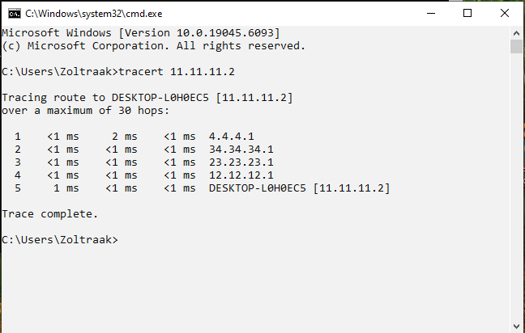  
  
# Kesimpulan
  Jadi, Static routing adalah konfigurasi jaringan di mana jalur data antar perangkat jaringan ditentukan secara manual. Static routing tidak akan berubah kecuali diubah. Static routing dikenal lebih aman karena pada static routing tidak ada update informasi tabel routing yang dikirimkan ke router lain. Tabel routing adalah kumpulan jalur routing yang telah dikonfigurasi. Informasi yang terdapat dalam tabel routing antara lain :  
 - network destination  
 - gateway
